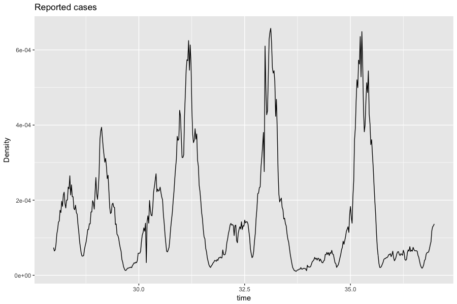
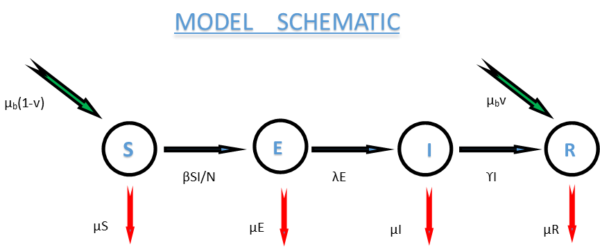
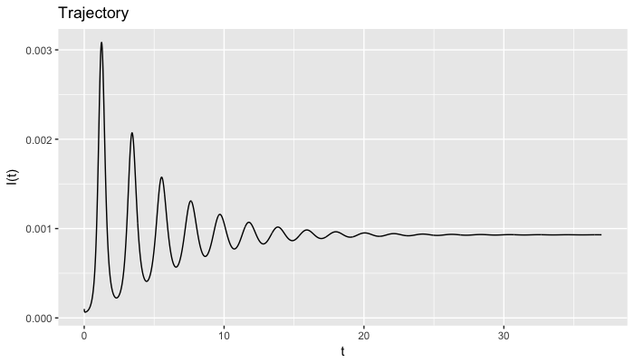
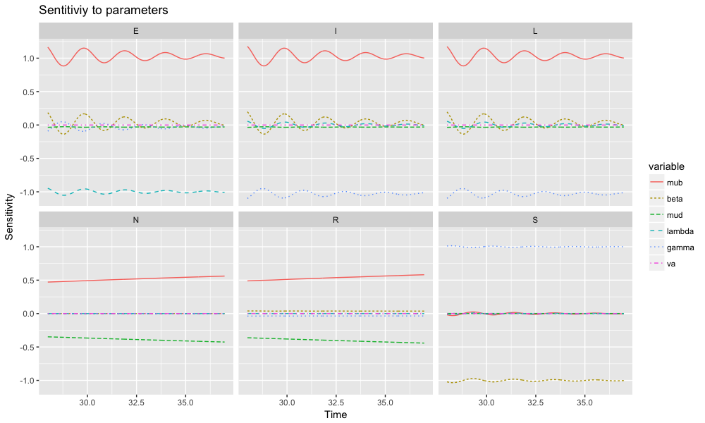
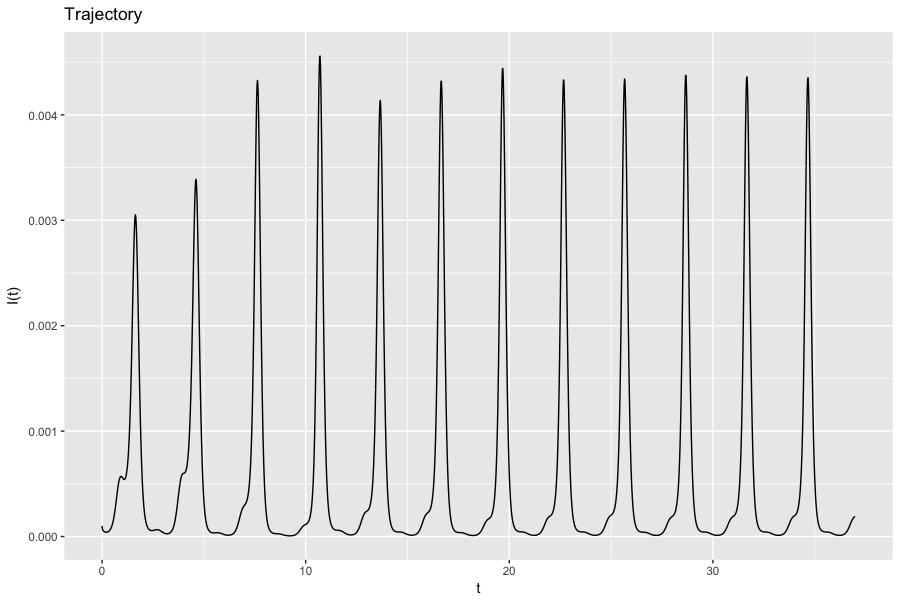
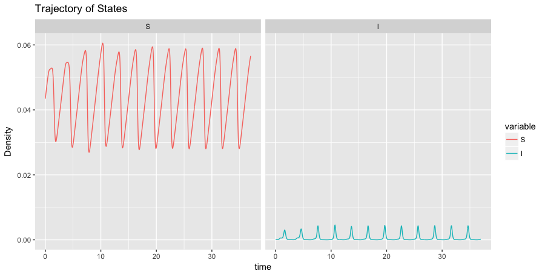
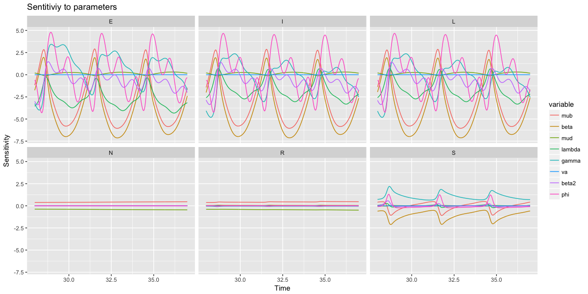
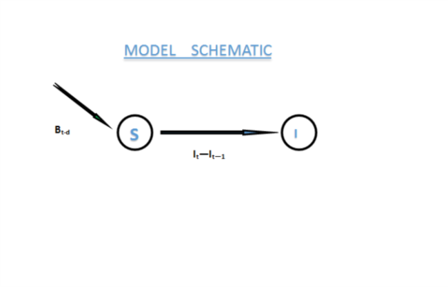

```{r setup, include=FALSE}
knitr::opts_chunk$set(echo = TRUE)
```

```{r,echo=FALSE}
Data = read.table("ewmeas.dat.txt")
Data = Data[1:469,2]/5.1e+07
```

```{r, message=FALSE,echo=FALSE}
library(deSolve)
require(pracma)
require(FME)
require(stats4)
require(bbmle)
require(ggplot2)


#Reporting Function
report=function(out, gamma = gamma){
  I= out[,4]
  C=c()
  for (i in 0:(468+1456) ){
    C[i+1]=0
    for (j in 1:7) {
      x=(7*i)+j
      C[i+1]=C[i+1] + gamma*I[x]*(1/(365.25*7))  
    }
  }
  return(C)
}
```

# INTRODUCTON AND LITERATURE REVIEW


## Introduction
Then the Lord said to Moses and Aaron, "Take handfuls of soot from a furnace and have Moses toss it into the air in the presence of Pharaoh. It will become fine dust over the whole land of Egypt, and festering boils will break out on men and animals throughout the land."—Exodus 9:8–9.


Mankind’s woes with infectious diseases is one of the few well documented facts in history, as it has greatly imparted on civilizations. Now, Public health personnel, Stakeholders and Society as whole invest resources to study and understand the dynamics of epidemics. Mathematical tools have been used to describe the dynamics of infectious diseases since  Daniel Bernoulli's smallpox model in 1766. The most popular of these are Mechanistic models, in which assumptions are made about the nature of the underlying disease dynamics, based on research and observations. With these assumptions we often have a system of equations, most often these are differential equations. This has been to great success. The eradication of small pox testifies to this fact.

## Mathematical Models

The role Mathematical models play in studying infectious disease dynamics cannot be overstated. The most common of these Mechanistic models are the compartmental models. Compartmental models are defined as systems in which there are flows of material between units called compartments [@Jacquez]. These compartments partition the population under study at any given time. For each compartment, its elements are time homogeneous (local homogeneity). Its governed by local mass balance, i.e. everthing going out of one compartment will go into the next compartment [@Jacquez]. In the epidemiological setting, these are models that group hosts, based on their states at infection [@Mishra10]. Lets take for example tuberculosis, the stages at infection here include; people who do not have the disease, those who have but are not yet spreading the disease, those who have and are spreading the disease, and those who have recovered from the disease. More generally,the most common groups (compartments) are the Susceptible, Exposed, Infectious, Recovered/Removed.

 *  Susceptible(S): This is the state at which the host can be, but isn't infected.
 *  Exposed(E): This is the state at which the host is infected, but not infectious.
 *  Infectious(I): This is the state at which the host is both infected and infectious
 *  Recovered/Removed(R): This is the state at which the host is either recovered from the disease, immune or has been isolated.
 There can be many of these compartments in a model and also  serveral additional compartments like  that of the vaccinated (V) etc. depending on the assumed disease dynamics. 

Assumptions are made about the transition(flow) of hosts from one compartments to the other, given these assumptions we have a system of differential equations whose solution are to reflect the disease dynamics. Sometimes after the development of the model, the realisations can be incompatible with observation, this gives strong indication of a major violation of an assumption, and this can be investigated and rectified, or the model might just not be adequate to describe the disease dynamics . For most of these compartments, the flow out is assumed to be proportional to the size of the compartment. That is if $K$ is a compartment and $r$ is the rate of movement out of $K$, then $K^{'}=-rK$ , which implies that $K(t)=exp\{-rt\}$. Thus $1/r$ is the average length of time in $K$. Movements into the compartment can be captured by adding terms to the right hand side of the differential equation.[@Hethcote00]

However, for the susceptible compartment we can have more complicated outflows, since this is related to infection. By nature, Transition Dynamic Models have force of infection as dependent on prevalence [@Mishra10] (The force of infection is the per capita incidence rate of infection per susceptible host).This most often leads to non-linearity in transmission. There are two popular forms of incidence; Standard Incidence and Mass Action.

 1.  Standard Incidence: Here we assume that the average rate of contact $\beta$ is constant. Thus by deduction our incidence is $(\beta S I)/N$. Where $N$ is the population size.
 2.  Mass Action: We assume that the average rate of contact is proportion to the population size $N$. This also gives us incidence as $\beta S I$. [@Hethcote00]

Assumptions do not only help in model formulation, they also help in simplifying the model. Even with that, most of the differential equations encountered in epidemiology are complex enough so that, it is difficult to find an analytic solution. However, without the analytic solution it still possible to study the system using qualitative methods and simulations. One of the main focal points of interest are bifurcation points. This are simply points at which before and after, the system changes its dynamics. The Basic Reproductive number $R_{0}$ is such a threshold point. This is the average number of secondary infections from the introduction of an infective into a completely susceptible population. When the Basic reproductive number is less than 1 [greater than 1], we have the disease-free equilibrium (the state of disease eradication) to be asymptotically stable [unstable]. This Bifurcation parameter is important because, through interventions like vaccination, we can change the magnitude of this parameter. And if we are able to reduce it to less than one, as in with smallpox then we are going to have the disease on decline and eventually eradicated eradicated.


## Childhood deseases

In quest to adequately studying the dynamics of infectious diseases, childhood diseases give a rare opportunity. Not only are its dynamics interesting as we'd later see, but the rich source of data available, helps us evaluate existing models and build mathematical and statistical tools to improve them and also, fit these models to new data to test their predictive ability. One such well documented  childhood disease is measles *(Black 1984; Anderson & May 1991)*.  Measles is a childhood disease with well-studied dynamics. Its relatively high infection rate, meant that in the pre-vaccination period, almost everyone was infected by age 20 [@Quadros04]. This made it of interest to stakeholders in most countries, hence a rich data is available on measles for most developed countries[@Grenfell02]. Measles is also interesting to epidemiologists because of its realtively simpler infection and recovery *(Black 1984)*, and it also exhibits both episodic and endemic dynamics *(Barlett 1957)*.

Before we discuss and compare the existing models for measles dynamics, let’s take a look at the biology and history of the disease.


# Measles

Measles is an infectious childhood disease caused by the ravioli virus of the Morbilli group of viruses. The mode of infection can be airborne (coughs and sneezes from an infected person), and also through direct contact to infected or exposed objects. The virus is infectious when it comes into contact with nose, mouth, eyes and skin. This makes it highly contagious.
7-18 days after exposure, symptoms are manifested. Thus the length of the exposed period is usually 8-10 days. The length of the infectious period is 8 days and this is between 4 days after the rush starts till 4 days after the rush. other symptoms are:

 *  Fever anorexia, cough and irritability
 *  Watery and red eyes with running nose.

People often recover fully from measles in 2 weeks, though it sometimes lasts for 3 weeks. Measles on its own doesn’t have disease related fatalities, however it can be very fatal to infants, people with weakened immune system from HIV and Malnutrition. 157700 people are recorded to have died from measles in 2011, combined with it been the leading cause of death with in children show how fatal it can be.


There is no cure for measles, as stated above most people recover naturally from it. However, there is a very effective vaccine  with a vaccine efficacy between 95% to 98% for people 6 months and older, since maternal imunity transfered to babies can interfere with vaccine efficacy [@Quadros04]. Yet, measles has made a comeback though it was eradicated from certain regions like the Americas. This is because  not everyone is and can be vaccinated:

 1. Some people have vaccine allergies
 2. Infants can be too young to be vaccinated
 3. HIV and other disease can weaken the immune system of host, and this makes vaccination life threatening
 4. A much recent campaign by "Anti-Vaxxers" against vaccination because it is rumored to cause autism in infants.

Measles is very infectious; it can take just one infectious person to start an outbreak. An infected person has a 90% chance of infecting unvaccinated people (i.e. up to 12 to 18 person). However, due to the fact that measles vaccination is almost perfect, vaccination below a critical value for a region is enough to attain herd immunity. This has been effective foe the Region of the Americas. The dynamics of the disease can be split into three different time frames. The pre-vaccination, transcient and post vaccination periods. Though the dynamics of the disease is well studied, what is well understood is the pre-vaccination and post vaccination dynamics. Most models developed for these two periods fit well to data. However, the same cannot be said about the transcient period. Below is a plot of the number of reported cases during the period.



### Mechanistic model 

lets consider a simple mechanistic SEIR model with vaccination data . Let the number of births be $\mu_{b}$, the death rate be $\mu$, the transmission rate be $\beta$ , the lenght of the latent period be $\lambda$, and the average lenght of infectiousness be $\gamma$. The expression on the right hand side for each state indicates the instantaneous rate of change of the states density.
The positive terms represent the growth of that density, likewise, the negative terms represent the decline, thus for the first differential equation, we have $\mu_{b}(1-v)$ to be the inflows into the susceptible compartment i.e. the number of births of unvaccinated  children, $\beta IS/N$  the infected outflow and $\mu S$ the number of susceptibles that die. We also assume standard incidence. Here we have a model where there is no vertical transimission, thus newborns are born into the susceptible class. Those in the suscebitble class can get infected and thus move to the exposed class, can be vaccinated  and move to the recovered class (We refrain from creating a vaccinated class because we are not interested in its density), or can simply remain in the vaccinated class. The exposed eventually get infectious and move into the infected class which then eventually move into the recoverd class. We assume that there is permanent immunity both from the being vaccinated and going and getting infected. There is also a constant death rate for the compartments which implies that there is no disease induced death.  Below is the model schematic.

#

We have the following as our derived differential equation from the model.


$$S'=\mu_{b}(1-v)-\beta IS/N -\mu S$$
$$E'=\beta SI/N - (\lambda + \mu)E$$
$$I'= \lambda E - (\gamma +\mu)I$$
$$R' = \gamma I - \mu R + \mu_{b}v$$


$$ S(0) \geq 0 , E(0) \geq 0 , I(0) \geq 0 , R(0) \geq 0$$

All parameters above are non negative.


Before we analyse and evaluate how good the model is, we first have to ensure that the model is well posed and it atleast has a solution.

#### INVARIANCE OF THE NON-NEGATIVE CONE

To ensure that the model is well posed we have to verify that these states representing population densities will never be negative given non negative initial condition.That shows that solution curves with non negative initial condition remain in the non-negative cone 
$$\{ T={(S,E,I,R) \mbox{ }|\mbox{ }  S(t)\geq 0, E(t)\geq 0, I(t)\geq 0, R(t)\geq 0 , \mbox{  }S(t)+E(t)+I(t)+R(t)=N(t)} \}$$. To do so, we examine the behavior of states on the boundary of the positive cone.

1.  When $S(t)=0$
    $$S'=\mu_{b}(1-v) $$
    Since  the right hand side is greater than zero, when the density of susceptibles gets to zero it immediately jumps up. And thus it     will never be negative.
    
2.  When $E(t)=0$
    $$E'=\beta SI/N $$
    Since  the right hand side is greater than or equal to zero, when the density of exposed gets to zero it immediately jumps up
    or remains at 0 depending on the density of suscebtibles and infected. This assures us of a non-negative density.
    
3.  When $I(t)=0$
    $$I'= \lambda E $$
    Since  the right hand side is greater than or equal to zero, when the density of infected decreases to zero it also rises or remains      at 0 depending on the density of the exposed.
    
4.  When $R(t)=0$
    $$R' = \gamma I + \mu_{b}v$$
    Since  the right hand side is greater than zero, when the density of recovered gets to zero it immediately jumps up.
    
    
Thus, we've show the non-negative cone is invariant.


### Existence and Uniqueness
Let 
$$f(S,E,I,R)= \begin{bmatrix}
 \ \
 \mu_{b}(1-v)-\beta IS/N -\mu S \\[0.3em]
\beta SI/N - (\lambda + \mu)E \\
\lambda E - (\gamma +\mu)I \\
 \gamma I - \mu R + \mu_{b}v
\end{bmatrix}$$

Since $f$ is continuous and $f^{\prime}$  is continuous at all points in its domain, $f$ is **Lipschitz** . By locally Lipschitz and continuity we have that the **solution exists and is unique**.


### Solutions are Bounded
To show that the solutions of this system exist for all time, we show that solutions are bounded. Adding the right hand sides of the above system of differential equations, we obtain
$$ N' = \mu_{b} - \mu N \\
   N(0)=N_{0}$$. 
This differential eqaution has analytical solution as $$N(t)=N_{0} e^{-\mu t} + \frac{\mu_{b}}{\mu}$$. Thus since $N(t)=S(t)+I(t)+E(t)+R(t)$, and the limiting value of $N(t)$ is thus $\frac{\mu_{b}}{\mu}$, we have that the solutions are bounded and exist for all time. 


A point $x^{*}$ is an equilibrium point if $f(x^{*}) = 0$. As this implies that that the rate of change in the state are all $0$, once the systems gets to an equilibrium point it stays there. Stability of a point is determined by how trajectories initialized close enough to the equilibrium point behave. Stability shows how small changes in initial condition will affect the system. The Disease-Free Equilibrium is the equilibrium assosiated with local disease extinction. That is when all infection related classes are $0$ and the system is at equilibrium. Also a system can be at equilibrium with the disease still persistent in the population. This type of equilibrium is refered to as the endemic equilibrium.

The Disease Free equilibrium (D.F.E) is evaluated to be 
$$\big(\frac{\mu_{b}(1-v)}{\mu},0,0,\frac{\mu_{b}}{\mu}v \big)$$

#PARAMETER ESTIMATES OF MODEL AND REALISATION
This model is however not adequate to describe the dynamics of the disease using prevaccination data. This model exhibits dump oscillations (transient fluctuations) that eventually goes to an equilibrium point. Recalling that the trajectories are intitiated much at 1920 to reduce the dependence on intial conditions, this transient "burn-out" period is what exhibits the fluctuation and thus there will almost be no information for minimizers for the parameter estimation. This can be seen in the figure below. Here the system goes to an endemic equilibrium with estimated parameters .

```{r, echo=FALSE}
pars <- c(mub=1.5/60, beta= 600, mud = 1/60, lambda = 365/8, gamma = 365/14,
          va = 0, s = 1/23, e = 0, i = 1e-4, r = 1-1/23-1e-4 ); pars 
```




## Sensitivity analysis
Sensitivity analysis determine how responsive the model states are to parameters. This helps us ascertain how uncertaintities affect our model and its solutions. For models with the closed forms of the analytic solutions known, the sensitivity functions are the derivatives of the states in respect to time. However not all models have anaylic solutions and most often to get the sentivity function we differentiate our model in respect to the parameters, this gives new differential eqautions (of sensitivities) which we solve alongside out main differential equation. For the SEIR model without forcing, giving the parameter values above, below is a plot of its sensitivities.



We see that the models states are almost insensitive to parameters , except for $\mu_{b}$ and $\mu$..  However from the magitude, shape and directions of these, we realise that the the conbined effect  also cancels out. 


#### The Basic Reproduction Number
With states at infection being $\{E,I\}$ we use the next generation matrix to find the basic reproductive number. Consider
$$
E'=\beta SI/N - (\lambda + \mu)E
$$
$$
I'= \lambda E - (\gamma +\mu)I
$$
if we decompose the  above as $X'=[T+\Sigma ]X$, where $T$ is for transmission i.e. the birth of newly infected, and $\Sigma$ is for transition from one compartment to the other,  the $R_{0}$ is the dominant eigenvalue of $K=-T\Sigma^{-1}$ evaluated at the D.F.E. Hence, we have our $R_{0}$ as $$\frac{\lambda \beta (1-v) }{( \lambda + \mu)(\gamma + \mu)}$$.


#### Model with Seasonal Forcing

As can be seen from the above  the dynamics of prevalence from the model doesnt match that observe, the seasonally (i.e. periodic nature) of prevalence isnt captured. We consider a modification of the model with seasonal forcing. Seasonal forcings illustrates the dynamic nature of certain parameters (in this case incidence).  In the above model  we assumed standard incidence with average rate of contact constant. We now use a sinusoidal functions for the average rate of contact. Adding seasonal forcing to this models adds adds its ability to capture the periodicity of the observed data. There ane serveral types of forcing that can be used. For measles a realistic forcing will be one that correspond to the school year, this is because measles is a childhood disease and is often transmitted at school. Examples of these are school-term forcing, where we mostly have peice-wise function with high maginitude when the school year begins in August, and $0$ or lesser values during the breaks. We however use a sinusoidal function to capture this partern. $\beta_{1}$ is the average rate of contact, $\beta_{1} \in (0,1)$ is an amplitude parameter, and $\phi \in (0,1)$ is a paratemer for adjusting periodicity. 
 We have the new model to be:

$$S'=\mu_{b}(1-v)-\beta_{1}\big(1 + \beta_{2} \cos(2 \pi (t - \phi))\big) \frac{SI}{N} -\mu S$$
$$E'=\beta_{1}\big(1 + \beta_{2} \cos(2 \pi (t - \phi))\big) \frac{SI}{N} - (\lambda + \mu)E$$
$$I'= \lambda E - (\gamma +\mu)I$$
$$R' = \gamma I - \mu R + \mu_{b}v$$


$$ S(0) \geq 0 , E(0) \geq 0 , I(0) \geq 0 , R(0) \geq 0$$
All parameters above are non negative.

The analysis of the system with seasonal forcing is almost identical to the one without seasonal forcing except for the stability analysis with require a more complicated method (Floquet Multipliers).
However in this case the model is (very) sensitive to parameters and with that parameter estimation is plausible. 

With estimated parameters as 
```{r}
gamma = 365/14

(pars <- c(mub=1/60, beta= 600, mud = 1/60, lambda = 365/8, gamma = 365/14,
          va = 0, s = 1/23, e = 0, i = 1e-4, r = 1-1/23-1e-4 , beta2 = .2, phi = .5))

```
we obtain a least-square estimate of 
```{r, echo=FALSE}

gamma = 365/14

pars <- c(mub=1/60, beta= 600, mud = 1/60, lambda = 365/8, gamma = 365/14,
          va = 0, s = 1/23, e = 0, i = 1e-4, r = 1-1/23-1e-4 , beta2 = .2, phi = .5)
#SEIRR Gives the Model realisation weekly and appends the Dataframe with Observation (L)
SEIRR<-function(pars){
  #parms[names(P)] <- P
  #pars = as.vector(pars)
  #Initial Conditions
  s = as.vector(pars[7])
  e = as.vector(pars[8])
  i = as.vector(pars[9])
  r = as.vector(pars[10])
  n = s+e+i+r 
  
  state <- c(S = s , E = e , I = i, R = r, N = n)
  
  sir_rhs=function(t,state,pars){
    
    
    with(as.list(c(state, pars)),{
      #rates of change
      dS <-  pars[1]*(1-pars[6]) -  (S*I*pars[2]*(1 + pars[11]*cos(2*pi*(t - pars[12]))))  - pars[3]*S
      dE <- (S*I*pars[2]*(1 + pars[11]*cos(2*pi*(t - pars[12])))) - (pars[4]+pars[3])*E
      dI <-  pars[4]*E - (pars[5]+pars[3])*I
      dR <- pars[5]*I + (pars[1]*pars[6]) - pars[3]*R
      dN <- pars[1] - pars[3]*N  
      
      # return the rate of change
      return(list(c(dS, dE, dI, dR, dN)))
    })
  }

  
  times <- seq(0, 37, by = 37/((469+1456)*7) )[1:((469+1456)*7)]

  out <- ode(y = state, times = times, func = sir_rhs, parms = pars)
  
  out=as.data.frame(out)
  
  
  time <- seq(0, 37, by = 37/((469+1456)*7) )[1:((469+1456)*7)]
  timesD<- cbind(t=0:13474,time) 
  ii <- which (timesD[,1] %in% seq(0, 13474, by = 7))
  
  Dat <- cbind(out[ii,], L=report(out,gamma))[-(1:1456),]
  return(Dat)
}

time <- seq(0, 37, by = 37/((469+1456)*7) )[1:((469+1456)*7)]
timesD<- cbind(t=0:13474,time) 
ii <- which (timesD[,1] %in% seq(0, 13474, by = 7))[-(1:1456)]


DataT <- cbind(time = timesD[ii,2], L= Data) # Appending time and Data


# Model Cost
SEIRRcost<- function(pars){
  out<-SEIRR(pars)
  cost <- modCost(model = out, obs = DataT)
  return(cost)
}

SEIRRcost(pars)$model

```

We clearly see the periodic nature of the trajectory in the figure below. The dynamics of the disease here mostly exhibits  bi-annual cycles .



We carry out local sensititvity analysis for our parameter set. The model will be inadequate if the parameters are insensitive. However, and contrary to that observed when using standard forcing we have that the states are very sensitive to parameters. The figure below shows the sensitivity plot of the states in respect to the parameters accross time. A sensitivity value approximately 1(-1) means the parameter has a strong positive(negative) relation with the state at that time. An almost $0$ signifies a no relation. Because the birth and death rate was set to make th initial condition constant, we have as expected that the total population size $N(t)$ is insensitive to any of the parameters, the next insensitive state is the recovered state $R(t)$. The other states however show periodic sensitivities in respect to parameters.






### Modeling Measles Outbreaks [@Jansen05]

As mention above the dynamics of an infectious disease is largely dependent on the Basic reproductive number $R_{0}$. When the $R_{0}>1$ the disease establishes itself in the host population and remains endemic, when $R_{0}<1$ the disease eventually dies out of the population. Considering the $R_{0}$ of the  model below (i.e. $R_{0}=\beta /\lambda$),


$$S'=-\beta IS$$
$$I'= \beta SI - \gamma I$$
$$R' = \gamma I $$
with $S+I+R=1$ (A scaled model).


  After introducing vaccination into the model the Basic reproductive number reduces to $R_{c}=\beta (1-c)/\lambda = R_{0}(1-c)$, where $c$ is the number of vaccinated people in the population. If we extend this model to include demography and vaccination rate ($v$),we get
$$S'= \mu N -\beta IS/N -(\mu+v)S $$ 

$$I'= \beta SI/N - (\gamma+ \mu) I$$ 

$$R' = \gamma I + vS - \mu R$$
with $S+I+R=N$ (Unscaled).
 This system however displays stochastic effects when $R_{0}$ approaches 1. For a supercritical system with $R_{0}$ approaching 1 we have an initially stochastic phase with phases out to a deterministic one. On the other hand, for the subcritical system we have the system demonstrating strong stochastic dynamics. To study the stochastic model for measles outbreaks, a stochastic model was formed with the following assumptions on the latter model:

 1. There is a large host population and its size will not be affected by the disease dynamics
 2. There are no vital dynamics and vaccination rate is set to 0 during the epidemic. ie the proportion of the vaccinated remains ($c$).


Assumption 2 is because of the relatively short span of epidemics as compared to demographic processes. This assumption reduces the model to a birth and death process with birth as $\lambda R_{c}$ and death as $\lambda$. And it is easy to derive an expression for the expectation and variance of the number of infected hosts, $I(t)$.


Though the time between jumps is exponentially distributed, to derive the size distribution of outbreaks, this was discarded and the time between jumps was fixed at 1, to simplify the model. The Gillespie algorithm was them use for obtain the probabilities of entering and leaving the initial state, which was $\frac{R_{c}}{R_{c}+1}$ and $\frac{1}{R_{c}+1}$ resp. The probability of an outbreak a certain size $x$ or larger is given by

$$\sum\limits_{x=n}^\infty q(x) = \max\big(0,1-\frac{1}{R_{c}} \big) + \frac{(4R_{c})^{n-1}(\Gamma(n-.5))}{(1+R_{c})^{2n-1}*\sqrt{\pi}n!} _{2}F_{1}\big(1,n-.5,n+1,\frac {4R_{c}}{(1+R_{c})^2}\big)$$

Where $_{2}F_{1}$ is the hypergeometric function, and $q(x)$ is the probability of an outbreak a certain size $x$.
A recent number of measles outbreak in UK as a result of the MMR scare can well be explain by the above dynamics. As the estimated $R_{c}$ jumps from 0.35 to 0.7, before and during the scare.


## Time series modelling of childhood diseases: a dynamical systems approach [@Finkenstadt00]


### Susceptible Reconstruction 
We will be using measles incidence data of the UK and Wales. The data used in the Grenfell Discrete time Model from 1944-1966. However the data available to  is from 1948-1966. Thus the analysis will be done on the later years.  However because of a setback with initial conditions of the susceptible reconstruction, we use the data of 1948 as the "burn-out" period. Hence data from 1949 unward will be considered in our estimation. Below is a graph of Incidence and Births for the given preiods.

```{r, echo=FALSE}
t = seq(0,9, by = 9/(468))[1:(468)] 
IData = read.table("ewmeas.dat.txt")
IData = IData[2:469,2]
BData = read.table("ew_bir.dat.txt")
BData = (BData[,2])/13 #Data is recorded quaterly, thus the resulting data is weekly
BData = rep(BData, each = 13)

```
```{r Birth and Incidence, fig.width=3, fig.height=3,echo=FALSE}
plot(t,BData, type="l", col="blue")

plot(t,IData, type="l", col="red")
```

 Data observed is only of reported cases, thus, there is no data available for the number of subsceptibles at a particular point in time, and even the incidence data collected is only partially observed, ie there is underreporting, and not everyone infected by the disease reports it. To address this, Susceptible Reconstruction Algorithm is used to reconstruct the dynamics of the unobserved susceptibles from birth and partially observed incidence data. This is done by regressing cumulative births and cummulative case notification. An assumption is first made of a constant reporting rate through time and this is estimated about 56.8%. 

The dynamics of the susceptible class can be described by 
$$S_{t} = B_{t-d} + S_{t-1} - I_{t} + U_{t}$$
$B_{t}$ being the number of Births at time $t$, with $d$ corresponding to a small delay that allows maternal immunity to dwindle. For measles its approximately 8 weeks.$S_{t}$ and $I_{t}$ are the number of susceptibles and infected at time $t$ respectively .We also have addictive error factor $U_{t}$, with $E(U_{t}) = 0$ and $Var(U_{t}) = \sigma^{2}_{U}$. For the transmission equation we have 
$$I_{t}=r_{t}I_{t-1}^{\alpha_{1}}S_{t-1}^{\alpha_{2}} \epsilon_{t}$$.
Here we assume multiplicative error for the total error is most likely to depend on the magnitude of the model values. We also have $E( \ln (\epsilon_{t})) = 0$ and $Var( \ln (\epsilon_{t})) = \sigma^{2}_{\epsilon}$. $r_{t}$ is a factor of proportionality that varies with time with a period of a year. $\alpha_{1} \mbox{ and } \alpha_{2}$ are mixing parameters, when $\alpha_{1} = \alpha_{2} =1$ we have homogeneous mixing.

### Reconstructing the Susceptible dynamics.
The Exposed and Infected period for measles last for 2 weeks then its followed by a life long immunity. Because the disease time scale is 2 weeks we aggregate the data bi-weekly. Thus the infected persons at time $t$ are related to contacts from time $t-1$, and also effect the number of infected at $t+1$.

 The number of true cases is proportional to the number of reported cases, i.e. $I_{t} = \rho_{t} C_{t}$, with $C_{t}$ the number of reported cases and $\rho_{t} \geq 1$ a random variable with $E(\rho_{t})=\rho$. Thus we have our susceptible equation as
$$S_{t} = B_{t-d} + S_{t-1} - \rho_{t} C_{t} + U_{t}$$

Letting $Z_{t}=S_{t}- \bar{S}$ , where $E(S_{t})=\bar{S}$ we get $E(Z_{t})=0$, subtracting $\bar{S}$ from both hannd side of the equation (The deviations of $S_{t}$ are recursively the same for $Z_{t}$) gives
$$Z_{t} = B_{t-d} + Z_{t-1} - \rho_{t} C_{t} + U_{t}$$

Successively iterating the above equation gives us, 
$$
Z_{t} = Z_{0}+\sum_{i=1}^{t} B_{i-d} - \sum_{i=1}^{t} \rho_{i} C_{i} + \sum_{i=1}^{t} U_{i}
$$


This is thus free from the autoregressive nature of our initial subsebtible requation. We reparametize our model with
$$
X_{t} = \sum_{i=1}^{t} C_{i} \mbox{ , }  Y_{t} = \sum_{i=1}^{t} B_{i-d} \mbox{ , } 
U_{t} = \sum_{i=1}^{t} u_{i} \mbox{ , }  R_{t} = \sum_{i=1}^{t} (\rho_{i}-\rho) C_{i} \mbox{ .} \\
$$

for  $t=1,...,n$ then the following are random processes.
$$
R_{t} = R_{t-1} + (\rho_{t}-\rho) C_{t}\\
U_{t} = U_{t-1} + u_{t}
$$

With the new notation we have, our regression equation as 
$$
Y_{t} = -Z_{t} + \rho X_{t} + R_{t} + Z_{t} - U_{t}
$$


```{r, echo= FALSE}
time = seq(0,9, by = 9/(226))[1:(226)] 

#Bi-weekly dataset
NewData = cbind(IData,BData)

```
```{r, echo=FALSE}
Biweekly=function(Data){
  n=nrow(Data)/2
  m=ncol(Data) 
  mat = matrix( ,n,m)
  for (i in 0:n - 1 ){
    mat[i + 1,]= rep(0, m)
    for (j in 1:2) {
      x = (2*i)+j
      mat[i+1,] = c(mat[i+1,]) + c(Data[x,])
    }
  }
  return(mat)
}

Cumulative = function(Data){
  n=nrow(Data)
  m=ncol(Data)
  Dta=matrix( ,n,m)
  Dta[1,] = Data[1,]
  for (i in 2:n){
    Dta[i,] = Dta[i-1,] + Data[i,]
  }
  
  return(Dta)
}
```

A subset of the Dataset can be seen from the Data below, with time, Culmulative Incidence, Culmulative Birth and Culmulative Error.
```{r Table of Data, echo=FALSE}
Fdat = Biweekly(NewData)

sigmaU = 1
set.seed(143)
U = rnorm(226,0,sd=sigmaU)
Fdat.d = cbind(Fdat[-(227:234),1],Fdat[-(1:8),2],U)

Fdat1 = Cumulative(Fdat.d) # Adjusting for the  delay caused by maternal immunity

NewData1 = cbind(Time=time,CIncidence=Fdat1[,1],CBirths=Fdat1[,2], U=Fdat1[,3])

NewData2 = as.data.frame(NewData1 )
head(NewData2)

```
 
Assuming a constant reporting rate and noise free data i.e $U_{t} \approx 0$ we have a simple linear relation of culmumative incidence on culmulative birth. A point estimate of the average reporting rate is the reciprocal of the  estimate of the slope. A summary of the simple linear regression and Analysis of Variance can be seen below.  

```{r, echo=FALSE}
fit <- lm(CBirths ~ CIncidence, data=NewData2)
summary(fit) 
# show results
plot(predict(fit)~CIncidence, data = NewData2)
```

```{r, echo=FALSE}

confint(fit, level=0.95) # CIs for model parameters 
anova(fit) # anova table 
# covariance matrix for model parameters 
```

We have our esitmate of the slope to be 1.488 , corresponding to a 67.2% average reporting rate. A 95% confidence interval for the average repoting rate is given as (66.29%,66.28%). All regression related tests were significant, and R-squared:  0.9887 signifies a strong possitive linear relation, with the regression model explaining 98.87 percent of the error.
The purpose of the regression equation is to estimate the Residuals , which about 0 has the same dymanics as $S_{t}$ about $\bar{S}$. And also the reporting rates $\rho_{t}$.  The estimates by [@Finkenstadt00] is a slope of 1.76 corresponding to a reporting rate of 56.8%. 


```{r, echo=FALSE}
# diagnostic plots 
layout(matrix(c(1,2,3,4),2,2)) 
# optional 4 graphs/page 
plot(fit)
```


Below are plots of the estimated residuals both with noice and without noise.
```{r, echo=FALSE}
Resid.noisefree=as.vector(residuals(fit))
# residuals
plot(Resid.noisefree~time, type="o", col="blue")

```


# Local Regression analysis
With the simple linear regression, we assumed a constant reporting rate. This however isnt realistic, to get a better address this we rather restict the constant reporting rates to within each of the bi-weeks. We therefore perform local regression analysis and this also gives us a better fit.  " references " and LRA.


```{r, echo=FALSE}
fit.loess <- loess(CBirths ~ CIncidence, data=NewData2, degree = 1, span = 1.49992)
summary(fit.loess) # show results

```

```{r, echo=FALSE}
Resid.loess=as.vector(fit.loess$residuals)+ NewData2$U# residuals
plot(Resid.loess~time, type="o", col="blue")
```

```{r, echo=FALSE}
require(locpol)

SSE2 = function(h){
  ESS = 0
  d <- data.frame(X = NewData2$CIncidence)
  d$Y <- NewData2$CBirths
  sd = sqrt(var(d$X))
  fit <- lm(CBirths ~ CIncidence, data=NewData2)
  lpest1 <- locPolSmootherC(d$X,d$Y , d$X, bw = h * sd, deg = 1, gaussK)
  lpest2 <- locpol(Y ~ X, data = d, bw = h * sd , kernel = gaussK, deg = 1, xeval = d$X)
  ESS = sum(lpest2$residuals^2)
  error = fitted.values(fit) - ( lpest1$beta0 + lpest2$lpFit$Y1 * lpest2$lpFit[,1])
  ESS1 = sum(error^2)
  return(c(ESS/1e+12,ESS1/1e+15))
}
x = seq(.1,10,.01)
y = sapply(x,SSE2)
plot(y[2,] ~ x, type = "l", col = "red", xlab = "h", ylab = "SSE", ylim= c(0,15))
lines(y[1,] ~ x, col = "blue")

```

```{r, echo=FALSE}
# Package for estimating the parameters of local regression.
d <- data.frame(X = NewData2$CIncidence)
d$Y <- NewData2$CBirths
plot(d$X,d$Y)
sd = sqrt(var(d$X))
lpest1 <- locPolSmootherC(d$X,d$Y , d$X, bw = .225 * sd , deg = 1, gaussK)
lpest2 <- locpol(Y ~ X, data = d, bw = .225 * sd , kernel = gaussK, deg = 1, xeval = d$X)
#lpest2$lpFit
#lpest2$residuals
```


```{r, echo=FALSE}
#Creating Dataset
fitlp = lpest1$beta0 + lpest2$lpFit$Y1 * lpest2$lpFit[,1]
fitlm = fitted.values(fit)
mydat = data.frame(lpest2$lpFit[,1:2], b0=lpest1$beta0, b1=lpest2$lpFit$Y1, 
                   fit=fitlp, resd=lpest2$residuals, fitlm)

```


```{r}
#Data needed is in Fdat.d and mydat

Data = data.frame( Fdat.d[,-3], mydat )
Data[,9] = Data[,1] * Data[,6] #Creating I(t)
Data[,10] = c( NA, Data[,8])[1:226] #Creating Z(t-1)
Data[,11] = c( NA, Data[,9])[1:226] #Creating I(t-1)
colnames(Data)[c(1:2,8,9,10,11)] = c("C","B","Z","I","Zt-1","It-1")


source('~/GitHub/Measles/TSIR parameter estimation.R', echo=F)

#Fitit(10) 
```


**"Work in progress!!!!!!!"**

#
 
## Dynamics of Measles Epidemics (Estimation and scaling of transmission Rates using a TSIR Model) [@Grenfell02] 


A study of the pre-vaccination era in UK shows two main dynamics; the endemic dynamics with periodicity which is exhibited in Large populations and the episodic outbreaks exhibited in smaller populations. The threshold differentiating this large and small population of hosts is estimated to be ~300000-500000. It is realized that endemism (The persistence of the disease in the host population) is dependent on the $R_{0}$ and also the susceptible replenishment rate (Grenfell and Harwood 1997). However, for non-persistent diseases, new outbreaks are dependent on reintroduction of the disease into the host population (Cliff et al 1993). A TSIR (Time Series SIR) Model was use to explore the balance between noise and episodic dynamics. The advantages of this model include
1. It can be scaled by population size to produce endemic and episodic dynamics
2. It bridges the gap between theoretical model and empirical data.

This model includes **seasonal forcing corresponding to the start of the school year** *(Seasonal forcing explains the periodicity of endemic dynamics) *. Also non-linearity in contact rates are allowed. The most relevant state variables consider are the number of infected and susceptible at any time $t$. The approach used was to generate the number of susceptible using the Susceptible Reconstruction Algorithm proposed by Finkenstadt and Grenfell (2000), and the record of birth and deaths during the fitting period.

There are some obstacles with this model, one of this is the Susceptible Reconstruction Algorithm is less reliable in the early part of the time series, because the "initial conditions" are difficult to estimate without some allowances.
The model was fitted to weekly data from 60 cities in the UK, collected weekly from 1944-1966. The data was aggregated on a 2 wk. interval to match the time scale of the disease. The rates are assumed fixed within this interval, thus the number of secondary cases from a single infection is geometrically distributed (Kendall 1949). Together with the assumption of independence the birth-death process will follow a negative binomial distribution (Kendall 1949). 
$$I_{t-1}~NB(\lambda_{t+1},I_{t})$$

with expectation $a$ and clumping parameter $b$. and $$ S_{t+1}=S_{t}+B_{t}-I_{t+1}$$
with this the model is fitted to data.


## Likelihood-based estimation of continous-time epidemic models from time-series data [@Cauchemez07]

Likelihood based estimation of parameters for our mechanistic models will be straight forward if infection and removal times are observed for each incident, however this isn’t possible because the available data is partially observed and aggregated often weekly. Though data augmentation methods have been used to tackle the missing data problems, this increases the complexity of likelihood based estimation when the number of missing data is huge.


TSIR model though fits well to data in some cases, makes strong assumptions which are not always applicable. One of such assumptions is that the epidemic and data collection processes should have the same time scales. This results from the discretization of a continuous time system because the case counts are usually weekly, and this is quite good if each time period is one generation period. Since TSIR models are unable to estimate the generation times (delay between infection of a case and their typical secondary case) of the disease they assume that the generation time is equal to the observation interval (or a constant multiple of it), which for the measles model above is taken to be two weeks. However, this is often not the case and continuous-time models are free of such constraint.

This model is applicable when we either have temporally aggregated datasets, and the number of size of underreporting is too large to use data augmentation techniques or the epidemic and data collection have different time scales.

The approach involves tackling missing data by augmenting the data with latent state at the beginning of each observational period. The relation between the latent states are derived from a Cox-Ingersoll-Ross process which copies the usual SIR process. The Metropolis-Hastings MCMC sampling is used to explore the joint posterior distribution of augmented data and parameters.

This continuous-time series model is unable to estimate generation times of measles accurately from observation data, though it does well for simulated data if the observation interval is less than 2.5 times the generation time.


##  Plug-and-play inference for disease dynamics [@He10]

Continuous-time SIR models adopts diffusion processes to implement MCMC, this breaks down in small populations. Several models make assumptions, and this makes them only locally valid. On the other, plug-and-play techniques makes little or no assumptions that interfere with the hypothesis of interest. This is because it operates basely on simulation from the dynamic model, and that brings its only disadvantage, it is computationally expensive. Two distinctive features about Plug-and-play methods have been considered in the optimization and complex system theory; gradient-free and equation-free.

Given a stochastic dynamic model (partially observed Markov processes), sequential Montecarlo is used to derive the log likelihood function. This means only path simulations are needed. This is done through iterated filtering contained in the R Software Package *POMP*. If identifiability issues are encountered further assumptions might resolve that issue. Otherwise, profile likelihood will aid in parameter estimation and identifiability. The model has force of infection as
$$ \mu_{SE}(t)= \frac{\beta (t)(I+i)^\alpha}{N(t)}$$
where $\beta (t)$ is the transmission rate which is seasonally forced to match the school year.

With the refinement in modeling tools, we are better equipped to describe the dynamics of measles, mostly separately since the transitions between the episodic and endemics dynamics, is not well understood. Before mass vaccination measles displayed regular endemic cycles which later changed to irregular ones. Most models using the normal SEIR setup and seasonal variation of transmission rate account for this transitions by endogenous dynamical reasons, such as chaos and stochastic shifts in existing stable cycles. This makes predicting transitions almost impossible. But the realization that susceptible replenishment rate affects the disease dynamics gives us a credible and exogenous factor which aids in predicting transitions. This is taken for granted when a constant birth rate is used in models for it ignores slow changes in this parameter. With the appropriate seasonal forcing of transmission rates (i.e. term time forcing), a simple SEIR framework well explains the disease dynamics without a complex age-structured host model [2].


# References
